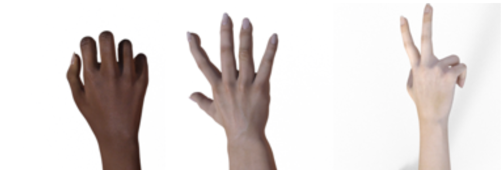

# rps-classifier ✊ ✋ ✌️

A rock-paper-scissors classifier built using fast.ai while reading chapter 2 of fastbook.

View it live [here](https://mybinder.org/v2/gh/ravimashru/rps-classifier/HEAD?urlpath=voila%2Frender%2Fwebapp.ipynb).

*Note: the app might take a few minutes to start; please be patient.* 🧘

## Dataset

My first attempt to gather data to train the model was using the `search_images_ddg` method as described in chapter 2 of fastbook. However, it was nearly impossible to get more than a handful of photos of a single hand in the positions that I needed.

After searching online for a while, I found the [rock_paper_scissors TensorFlow dataset](https://www.tensorflow.org/datasets/catalog/rock_paper_scissors) and used it to train the model.

## Training

Pretrained models allow us to train more accurate models faster. I started with a pretrained `resnet18` model and fine-tuned it on the dataset. The `error_rate` hit 0 within an epoch! 🚀

I used [Google Colaboratory](http://colab.research.google.com) to train the model. Using the free GPUs they provide, the model was trained in about a minute! ⚡️

The code I used to train the model can be found in the [training.ipynb](training.ipynb) notebook.

## Web Application

I used [Voila](https://github.com/voila-dashboards/voila) and [Binder](https://mybinder.readthedocs.io/en/latest/introduction.html) to deploy the application. All you need to deploy a web application to Binder using Voila is a Juypter notebook!

The code I used to create the web application can be found in the [webapp.ipynb](webapp.ipynb) notebook.

You can learn more about how to use Voila and Binder to easily convert a Jupyter notebook to a web app from [chapter 2 of fastbook](https://github.com/fastai/fastbook/blob/master/02_production.ipynb).

## Lessons Learnt

When training the model, the error rate became 0. This was exciting because it meant the model had perfectly learnt how to distinguish between rock, paper and scissors in the validation set! However, when I deployed the app the model was getting many predictions very wrong.

As I read chapter 2 further, I realized I was dealing with **out-of-domain data**. The data the model was seeing during inference was significantly different from the data the model was trained on.

As you can see from the image at the top of this page, the training images were of 3D rendered hands with no objects in the background. However, photos I was taking of my hand had a lot of objects in the background. Even when I tried taking pictures against a plain bright background, my actual hand looked very different from the 3D images used for training.
